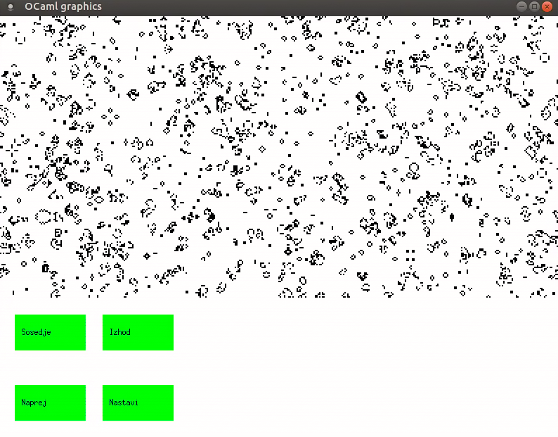
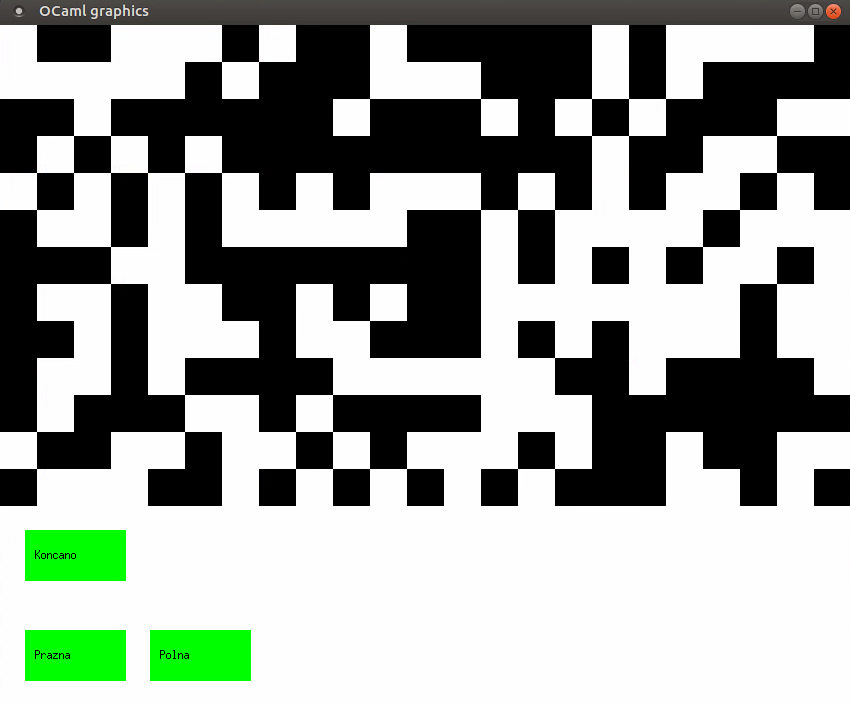
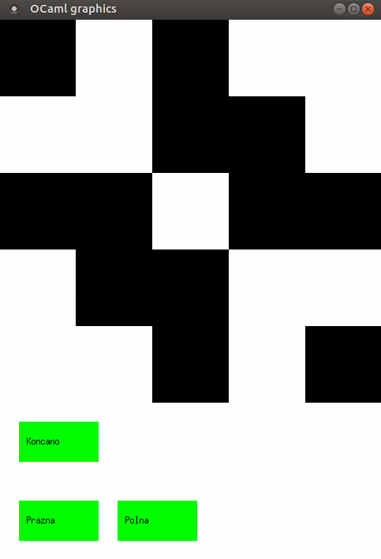
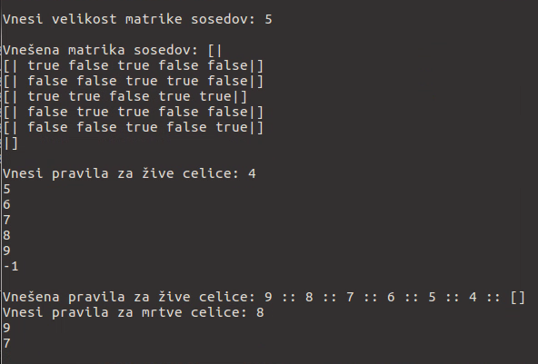

# Celični avtomat

Projekt vsebuje implementacijo dvodimenzionalnega periodičnega [celičnega avtomata](https://en.wikipedia.org/wiki/Cellular_automaton) z možnostjo spreminjanja pravil s preprostim uporabniškim vmesnikom.

## Definicija
Celični avtomat je množica celic v (po možnosti neskončni) tabeli. Vsaka celica je lahko v končno mnogo stanjih in ima s tabelo definirane sosede.

Spreminjanje celic/evolucija poteka po korakih. Stanje celice $C$ na naslednjem koraku se določi na podlagi evolucijske funkcije trenutnega stanja celice $C$ in stanja sosedov te celice.

Primer, ki je implementiran dovoljuje za vsako celico natanko dve stanji `true` in `false`, ki zaporedoma ponazarjata živo in mrtvo celico. Ker na računalniku ni mogoče simulirati neskončno velike tabele se velikost tabele izbere pri zagonu programa in se uporabijo periodični robni pogoji, ki za celice na robu pomenijo da se tabela pri njih nadaljuje naprej na nasprotni rob. S tem dobimo kvadratno tabelo na torusu.

# Uporaba
Program se poganja v Linux terminalu z naslednjima ukazoma:
`dune build`
`./grafika.exe`

Nato vnesemo želeno število korakov med dvema zaporednima prikazoma na zaslonu (risanje na zaslon je precej potratno s časom, tako da se lahko izbere npr. možnost, da se izpiše vsak tisoči korak, če nas zanimajo le končna stanja).
Sledi vnos želene velikosti tabele. Tabelo je smiselno narediti manjšo od `200x400`, da je risanje še smiselno hitro in je resolucija dovolj velika.

|  |
|:--:| 
| Prva stran celičnega projekta |

Ko se projekt inicializira je začetna postavitev nastavljena naključno. Črna barva predstavlja žive celice in bela barva mrtve. Na dnu zaslona so štirje gumbi:

## `Naprej`
Ob kliku na gumb se vsaka celica na vrhu spremeni po določenem pravilu. Osnovna pravila so enaka kot pri Conwayevi [Igri Življenja](https://en.wikipedia.org/wiki/Conway%27s_Game_of_Life). V kolikor uporabnik pravila spremeni se seveda upošteva nastavljena pravila. Če je izbrano število korakov med zaporednima prikazoma večje od $1$, tedaj se ne prikaže vsak korak evolucije.

## `Nastavi`
Gumb nas odpelje na novo stran, kjer lahko s klikom na celice spremenimo njihovo trenutno stanje. Če je bila celica, na katero smo kliknili, živa, je sedaj mrtva in obratno. Za priročnost sta dodana še gumba `Prazna` in `Polna`, ki nastavita vse celice na mrtve ali pa vse celice na žive. 

Gumb `Presenecenje` nastavi tabelo na eno izmed preprostih a zanimivih pozicij, ki si jih je vredno pogledati in ugotoviti, zakaj so si zaslužile svoje mesto v projektu. Ogromno drugih začetnih postavitev za Conwayevo igro življenja si lahko pogledam na [povezavi](https://playgameoflife.com/lexicon).

Ko smo zadovoljni s svojo umetniško stvaritvijo se s klikom na gumb `Koncano` vrnemo na prejšnjo stran.

|  |
|:--:| 
| Nastavitvena stran |

## `Sosedje`

Ob kliku na ta gumb se okno zapre in nas v ukazni vrstici program vpraša za želeno velikost matrike sosedov. Vpisati je potrebno liho naravno število $2k+1$, iz katerega se nato ustvari $(2k+1)\times (2k+1)$ matrika sosedov, kjer centralni element predstavlja celico, ki jo gledamo, za sosede pa lahko definiramo celice, ki so za največ $k$ oddaljene od opazovane celice glede na [razdaljo Čebiševa](https://en.wikipedia.org/wiki/Chebyshev_distance).

Nato se odpre povsem identično okno kot pri gumbu `Nastavi` in z enakimi operacijami sedaj izberemo, katere celice bomo obravnavali kot sosede centralne celice. Celice označeno s črno se bodo upoštevale kot sosednje celice, neoznačene celice pa ne. Večinoma se za sosede obravnava neko simetrično okolico okoli centralnega elementa, ni pa to nujno. Centralni element je lahko tudi sosed samemu sebi, če to tako označimo.

|  |
|:--:| 
| Nastavitev matrike sosedov |

Ko smo zadovolnji z izbiro kliknemo gumb `Koncano` in okno se zapre in v ukazni vrstici nam izpiše izbrano sosedsko matriko. Nato nas vpraša po pravilih za žive celice.

Implementirana pravila so omejena na funkcije, ki imajo za argumenta le trenutno stanje opazovane celice in število vseh živih sosedov glede na definirano sosedsko matriko.

Pravilo za žive celice je seznam nenegativnih celih števil, ki vsebuje vse vrednosti števil živih sosedov, za katere želimo, da opazovana celica ostane živa. Vrednosti vnašamo zaporedoma in jih ločujemo s tipko `Enter`. Ko smo vnesli vse želene vrednosti, vnos zaključimo z vpisom števila $-1$.

Povsem ekvivalentno je pravilo za mrtve celice, ki torej vsebuje vse vrednosti števil živih sosedov, za katere želimo, da opazovana celica oživi. Vnos spet zaključimo s številom $-1$.

Ob zadnjem vnosu števila $-1$ se nam nazaj odpre osnovno okno in lahko nadaljujemo s koraki glede na novo definirana pravila.

|  |
|:--:| 
| Nastavitev pravil |

## `Izhod`
Okno se zapre in program se zaključi.

# Razno

Dovolj velika tabela s periodičnimi robnimi pogoji je v prvih nekaj korakih ekvivalentna ekspanzivni tabeli, ki se veča sama od sebe, ko zazna, da bi lahko oživela kakšna celica, ki in za sosedo celico izven robu. Je pa implementacija ekspanzivne tabele precej zahtevnejša.

V osnovi je pravilo za naslednjo generacijo le funkcija trenutne celice in števila živih sosedov, z uporabo dovolj velike sosedske matrike pa je to ekvivalentno poljubni funkciji sosedov. Če si na primer za sosede izberemo 4 celice, ki se dotikajo centralne s stranico lahko sosedsko matriko naredimo večjo od naše tabele, in označimo celice tako, da je levi sosed označen enkrat, zgornji dvakrat, desni štirikrat in spodnji osemkrat. Naša funkcija bo torej kot argument vzela centralni element in $Levi + 2 Zgornji + 4 Desni + 8 Spodnji$, kar vemo, da je binaren zapis nekega števila med 0 in 15. Se pa s tem seveda precej poveča računski čas, saj izločanje sosedov ni optimizirano na velike sosedske matrike.

# Zahteve za poganjanje

V repozitoriju je datoteka `grafika.exe`, ki je Linux executable in ne Windows executable, čeprav se konča s končnico `.exe`

V kolikor se želi poganjati izvorno kodo je treba poganjati ocaml datoteke, zato je nujen naložen ocaml s knjižnicami `dune` in `graphics`.

# Struktura datotek

Glavna datoteka je `grafika.ml`, pomožna pa `pravila.ml`. Zaradi precej preproste struture projekta ni datotek `.mli`.
