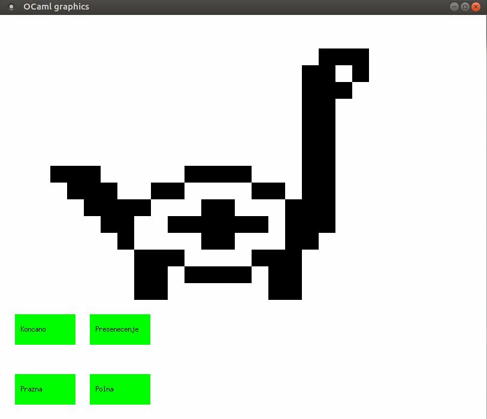

# Celični avtomat

Projekt vsebuje implementacijo dvodimenzionalnega periodičnega [celičnega avtomata](https://en.wikipedia.org/wiki/Cellular_automaton) z možnostjo spreminjanja pravil s preprostim uporabniškim vmesnikom.

## Definicija
Celični avtomat je množica celic v (po možnosti neskončni) tabeli. Vsaka celica je lahko v končno mnogo stanjih in ima s tabelo definirane sosede.

Spreminjanje celic/evolucija poteka po korakih. Stanje celice $C$ na naslednjem koraku se določi na podlagi evolucijske funkcije trenutnega stanja celice $C$ in stanja sosedov te celice.

Primer, ki je implementiran dovoljuje za vsako celico natanko dve stanji `true` in `false`, ki zaporedoma ponazarjata živo in mrtvo celico. Ker na računalniku ni mogoče simulirati neskončno velike tabele se velikost tabele izbere pri zagonu programa in se uporabijo periodični robni pogoji, ki za celice na robu pomenijo da se tabela pri njih nadaljuje naprej na nasprotni rob. S tem dobimo kvadratno tabelo na torusu.

# Uporaba
Program se poganja v Linux terminalu z naslednjima ukazoma:
`dune build`
`./grafika.exe`

Nato vnesemo želeno število korakov med dvema zaporednima prikazoma na zaslonu (risanje na zaslon je precej potratno s časom, tako da se lahko izbere npr. možnost, da se izpiše vsak tisoči korak, če nas zanimajo le končna stanja).
Sledi vnos želene velikosti tabele. Tabelo je smiselno narediti manjšo od `200x400`, da je risanje še smiselno hitro in je resolucija dovolj velika.

|  |
|:--:| 
| Prva stran celičnega projekta |

Ko se projekt inicializira je začetna postavitev nastavljena naključno. Črna barva predstavlja žive celice in bela barva mrtve. Na dnu zaslona so štirje gumbi:

## `naprej`
Ob kliku na gumb se vsaka celica na vrhu spremeni po določenem pravilu. Osnovna pravila so enaka kot pri Conwayevi [Igri Življenja](https://en.wikipedia.org/wiki/Conway%27s_Game_of_Life). V kolikor uporabnik pravila spremeni se seveda upošteva nastavljena pravila. Če je izbrano število korakov med zaporednima prikazoma večje od $1$, tedaj se ne prikaže vsak korak evolucije.

## `nastavi`
Gumb nas odpelje na novo stran, kjer lahko s klikom na celice spremenimo njihovo trenutno stanje. Če je celica, na katero smo kliknili, bila živa, je sedaj mrtva in obratno. Za priročnost sta dodana še gumba `Prazna` in `Polna`, ki nastavita vse celice na mrtve ali pa vse celice na žive. Ko smo končali z nastavitvijo se s klikom na gumb `Koncano` vrnemo na prejšnjo stran.

|  |
|:--:| 
| Nastavitvena stran |

## `sosedje`

Ob kliku na ta gumb se okno zapre in nas v ukazni vrstici program vpraša za želeno velikost matrike sosedov. Vpisati je potrebno liho naravno število $2k+1$, iz katerega se nato ustvari $(2k+1)\times (2k+1)$ matrika sosedov, kjer centralni element predstavlja celico, ki jo gledamo, za sosede pa lahko definiramo celice, ki so za največ $k$ oddaljene od opazovane celice glede na [razdaljo Čebiševa](https://en.wikipedia.org/wiki/Chebyshev_distance).

Nato se odpre povsem identično okno kot pri gumbu `nastavi` in z enakimi operacijami sedaj izberemo, katere celice bomo obravnavali kot sosede centralne celice. Celice označeno s črno se bodo upoštevale kot sosednje celice, neoznačene celice pa ne. Večinoma se za sosede obravnava neko simetrično okolico okoli centralnega elementa, ni pa to nujno. Centralni element je lahko tudi sosed samemu sebi, če to tako označimo.

|  |
|:--:| 
| Nastavitev matrike sosedov |


Ko smo zadovolnji z izbiro kliknemo gumb `konec` in okno se zapre in v ukazni vrstici nam izpiše izbrano sosedsko matriko. Nato nas vpraša po pravilih za žive celice.

Implementirana pravila so omejena na funkcije, ki imajo za argumenta le trenutno stanje opazovane celice in število vseh živih sosedov glede na definirano sosedsko matriko.

Pravilo za žive celice je seznam nenegativnih celih števil, ki vsebuje vse vrednosti števil živih sosedov, za katere želimo, da opazovana celica ostane živa. Vrednosti vnašamo zaporedoma in jih ločujemo s tipko `Enter`. Ko smo vnesli vse želene vrednosti, vnos zaključimo z vpisom števila $-1$.

Povsem ekvivalentno je pravilo za mrtve celice, ki torej vsebuje vse vrednosti števil živih sosedov, za katere želimo, da opazovana celica oživi. Vnos spet zaključimo s številom $-1$.

Ob zadnjem vnosu števila $-1$ se nam nazaj odpre osnovno okno in lahko nadaljujemo s koraki glede na novo definirana pravila.

|  |
|:--:| 
| Nastavitev pravil |

## `izhod`
Okno se zapre in program se zaključi


Glavna datoteka je grafika.ml, pomožni sta pravila.ml in izlocisosede.ml. Na začetku datoteka vpraša za višino in širino, čeprav ni izpisanega stringa za to
mogoče bi še grafiko dal posebej da bo main lepo kratek in naredil .mli datoteke za vsako stvar, idk

TODO: ugotoviti, zakaj širina večja od *višine* ne dela, preveriti, če je s pravili vse v redu, da so res periodični boundary conditioni DONE


TODO: Narediti customizable pravila - dodaten gumb, ki bo zaprl graf in nas vprašal za velikost n, potem se odpre nazaj grafika in nam pokaže 2n+1 veliko tabelo, ki jo obkljukamo/odkljukamo, nato pa izberemo meje, kdaj živa umre in mrtva oživi
Pravilo bo simple, da se samo prešteje število živih sosedov in glede na to sklepa, ali umre ali živi, bom pa dopustil uporabo zapletenih okolic. DONE

TODO: Spremeniti velikost celic, da so pri velikih tabelah posamezni kvadratki majhni, ker ne sme biti fiksna velikost 100 DONE
TODO: Izboljšati posodabljanje celic, da posodabljamo res samo tiste celice, ki se spremenijo, drugače se mi zdi, da tole vzame preveč časa in zgleda glitchy DONE

TODO naredi class gumbov, s katerimi bo lažje delati, da preverim, ali sem kliknil nanje DONE

TODO: dodaj možnost, da se matrika nastavi na same mrtve/žive, to je izi en gumb DONE

TODO: Ugotoviti zakaj je tako počasno??? Risanje sem zej kar pohitril, še posebej za večinoma mrtve matrike, zej pa lahko probam pohitriti še korak delno DONE
TODO: Naredi bolj user friendly, dodaj izpise, označi malo DONE

poganjanje: dune build
./grafika.exe
(vnesi višino)
(vnesi širino)
Zaenkrat so zraven še vse profesorjeve datoteke, da si lahko pomagam z njimi, na koncu jih moram odstraniti

# Končni avtomati

Projekt vsebuje implementacijo končnih avtomatov, enega najpreprostejših računskih modelov, ter njihovo uporabo pri karakterizaciji nizov. Končni avtomat začne v enem izmed možnih stanj, nato pa glede na trenutno stanje in trenutni simbol preide v neko novo stanje. Če ob pregledu celotnega niza konča v enem od sprejemnih stanj, je niz sprejet, sicer pa ni.

Za tekoči primer si oglejmo avtomat, ki sprejema nize, sestavljene iz ničel in enic, v katerih da vsota enic pri deljenju s 3 ostanek 1. Tak avtomat predstavimo z naslednjim diagramom, na katerem je začetno stanje označeno s puščico, sprejemna stanja pa so dvojno obkrožena.

TODO

## Matematična definicija

Končni avtomat je definiran kot nabor $(\Sigma, Q, q_0, F, \delta)$, kjer so:

- $\Sigma$ množica simbolov oz. abeceda,
- $Q$ množica stanj,
- $q_0 \in Q$ začetno stanje,
- $F \subseteq Q$ množica sprejemnih stanj in
- $\delta : Q \times \Sigma \to Q$ prehodna funkcija.

Na primer, zgornji končni avtomat predstavimo z naborom $(\{0, 1\}, \{q_0, q_1, q_2\}, q_0, \{q_1\}, \delta)$, kjer je $\delta$ podana z naslednjo tabelo:

| $\delta$ | `0`   | `1`   |
| -------- | ----- | ----- |
| $q_0$    | $q_0$ | $q_1$ |
| $q_1$    | $q_2$ | $q_0$ |
| $q_2$    | $q_1$ | $q_2$ |

## Navodila za uporabo

Ker projekt služi kot osnova za večje projekte, so njegove lastnosti zelo okrnjene. Konkretno implementacija omogoča samo zgoraj omenjeni končni avtomat. Na voljo sta dva vmesnika, tekstovni in grafični. Oba prevedemo z ukazom `dune build`, ki v korenskem imeniku ustvari datoteko `tekstovniVmesnik.exe`, v imeniku `html` pa JavaScript datoteko `spletniVmesnik.bc.js`, ki se izvede, ko v brskalniku odpremo `spletniVmesnik.html`.

Če OCamla nimate nameščenega, lahko še vedno preizkusite tekstovni vmesnik prek ene od spletnih implementacij OCamla, najbolje <http://ocaml.besson.link/>, ki podpira branje s konzole. V tem primeru si na vrh datoteke `tekstovniVmesnik.ml` dodajte še vrstice

```ocaml
module Avtomat = struct
    (* celotna vsebina datoteke avtomat.ml *)
end
```

### Tekstovni vmesnik

TODO

### Spletni vmesnik

TODO

## Implementacija

### Struktura datotek

TODO

### `avtomat.ml`

TODO

### `model.ml`

TODO
